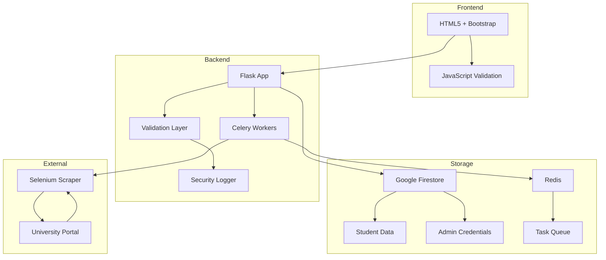

# 🚗 PUG - Portal Universitario de Grupo de Viaje

     

## 📋 Descripción

**PUG (Portal Universitario de Grupo)** es una aplicación web desarrollada para estudiantes de la **Pontificia Universidad Gregoriana** que permite formar grupos de viaje compartido basándose en horarios académicos compatibles.

### 🎯 Objetivo Principal

Conectar estudiantes que tienen horarios similares para que puedan compartir viajes hacia y desde la universidad, optimizando costos de transporte y fomentando la comunidad estudiantil.

## ✨ Características Principales

### 🔐 Integración con Portal Real
- **Conexión directa** al portal universitario oficial (`segreteria.unigre.it`)
- **Autenticación segura** con credenciales reales del estudiante
- **Extracción automática** de datos personales y horarios académicos
- **Selenium WebDriver** con configuración de seguridad avanzada

### 🤖 Sistema Inteligente de Demostración
- **Detección automática** de horarios no publicados
- **Generación de datos demo** realistas cuando los horarios oficiales no están disponibles
- **Transición automática** a datos reales cuando la universidad publique los horarios
- **Interfaz clara** que distingue entre datos reales y de demostración

### 🧩 Algoritmo de Matchmaking
- **Análisis de horarios** para encontrar coincidencias de viaje
- **Grupos de ida y vuelta** organizados por días y horarios
- **Optimización de compatibilidad** de horarios académicos
- **Visualización clara** de grupos compatibles

### 🛡️ Seguridad y Privacidad
- **Enmascaramiento de credenciales** en logs
- **Limpieza automática** de datos sensibles
- **Auditoría de seguridad** con 10 verificaciones críticas
- **Sesiones seguras** con timeouts configurables
- **Logging estructurado** para monitoreo

## 🔧 Tecnologías Utilizadas

#### Backend
- **Flask 2.3+** - Framework web principal
- **Celery** - Procesamiento asíncrono de tareas
- **Redis** - Backend para Celery y cache
- **Firebase Firestore** - Base de datos NoSQL
- **Selenium WebDriver** - Automatización del navegador

#### Frontend
- **Bootstrap 5** - Framework CSS responsivo
- **JavaScript Vanilla** - Validación en tiempo real
- **HTML5** - Estructura semántica

#### Seguridad y DevOps
- **Python-dotenv** - Gestión de variables de entorno
- **Werkzeug** - Utilidades de seguridad
- **Docker** - Containerización (opcional)

## 🚀 Instalación y Configuración

### 📋 Prerrequisitos

1. **Python 3.9+**
2. **Google Chrome** instalado en el sistema
3. **Redis Server** (para Celery)
4. **Credenciales Firebase** (archivo `credenciales.json`)

### 🔧 Configuración del Entorno

1. **Clonar el repositorio:**
```bash
git clone https://github.com/JetIAbot/PUG.git
cd PUG
```

2. **Crear entorno virtual:**
```bash
python -m venv venv
source venv/bin/activate  # Linux/Mac
# o
venv\\Scripts\\activate   # Windows
```

3. **Instalar dependencias:**
```bash
pip install -r requirements.txt
```

4. **Configurar variables de entorno:**
```bash
cp .env.example .env
# Editar .env con tus configuraciones
```

### ⚙️ Variables de Entorno Principales

```env
# Portal Universitario
USE_REAL_PORTAL=True
PORTAL_URL=https://segreteria.unigre.it/asp/authenticate.asp

# Configuración de Selenium
HEADLESS_MODE=False
BROWSER_PRIVATE_MODE=True
REQUEST_TIMEOUT=60

# Seguridad
MASK_CREDENTIALS=True
CLEAR_SESSION_ON_EXIT=True
SESSION_TIMEOUT_MINUTES=30

# Flask
FLASK_SECRET_KEY=tu_clave_secreta_aqui
```

### 🔥 Configuración de Firebase

1. Crear proyecto en [Firebase Console](https://console.firebase.google.com/)
2. Generar credenciales de servicio
3. Guardar como `credenciales.json` en la raíz del proyecto
4. Configurar Firestore Database

## 🏃 Ejecución

### 🔴 Iniciar Redis (requerido)
```bash
# Linux/Mac
redis-server

# Windows
redis-server.exe
```

### 🌐 Ejecutar la aplicación
```bash
python src/app.py
```

La aplicación estará disponible en: `http://127.0.0.1:5000`

## 📱 Uso de la Aplicación

### 1. 🔑 Acceso Inicial
- Acceder a `http://127.0.0.1:5000`
- Ingresar **matrícula y contraseña** reales de la universidad
- El sistema se conectará al portal oficial para verificar credenciales

### 2. 📊 Extracción de Datos
- **Conexión automática** al portal universitario
- **Extracción de información personal:** nombre, apellido, matrícula
- **Extracción de horarios:** materias, profesores, aulas, horarios
- **Manejo inteligente:** si los horarios no están publicados, se generan datos de demostración

### 3. ✅ Revisión y Completado
- **Revisar datos extraídos** del portal
- **Completar información de conducción:** licencia, tipos, vencimiento
- **Guardar perfil** para matchmaking

### 4. 🎯 Matchmaking
- **Análisis automático** de compatibilidad de horarios
- **Grupos de viaje** organizados por días y horarios
- **Visualización clara** de coincidencias de ida y vuelta

## 🛡️ Características de Seguridad

### 🔒 Protección de Datos
- **Enmascaramiento automático** de credenciales en logs
- **Limpieza de sesiones** al cerrar navegador
- **Timeouts de seguridad** configurables
- **Auditoría completa** de accesos y operaciones

### 🔍 Monitoreo y Logs
- **Logs estructurados** en JSON
- **Separación de logs:** app, security, audit, errors
- **Rotación automática** de archivos de log
- **Alertas de seguridad** para eventos críticos

### ✅ Verificaciones de Seguridad

El sistema incluye **10 verificaciones críticas de seguridad:**
1. Variables de entorno sensibles
2. Archivos de credenciales
3. Configuración de logging
4. Timeouts de sesión
5. Enmascaramiento de datos
6. Limpieza de cache
7. Configuración de Selenium
8. Permisos de archivos
9. Configuración de red
10. Validación de entrada

## 🧪 Testing

### 🔬 Ejecutar pruebas del sistema
```bash
cd src
python test_sistema_rapido.py
```

### 🌐 Verificar conectividad del portal
```bash
python scripts/test_portal.py
```

### 🔧 Diagnóstico de Chrome
```bash
python scripts/test_chrome.py
```

## 📁 Estructura del Proyecto

```
PUG/
├── src/                          # Código fuente principal
│   ├── app.py                   # Aplicación Flask principal
│   ├── matchmaking.py           # Algoritmo de matchmaking
│   ├── portal_connector.py      # Conector seguro al portal
│   ├── demo_data_generator.py   # Generador de datos demo
│   ├── validators.py            # Validadores de formularios
│   ├── logger_config.py         # Configuración de logging
│   └── constants.py             # Constantes de la aplicación
├── templates/                    # Plantillas HTML
│   ├── index.html              # Página principal
│   ├── revisar.html            # Revisión de datos
│   └── admin.html              # Panel administrativo
├── static/                       # Archivos estáticos
│   ├── css/                    # Estilos CSS
│   └── js/                     # JavaScript
├── scripts/                      # Scripts de utilidad
│   ├── test_portal.py          # Pruebas del portal
│   ├── security_check.py       # Verificación de seguridad
│   └── analyze_logs.py         # Análisis de logs
├── tests/                        # Pruebas unitarias
├── requirements.txt              # Dependencias Python
├── .env.example                 # Ejemplo de configuración
├── docker-compose.yml           # Configuración Docker
└── README.md                    # Documentación
```

## 🚦 Estado del Proyecto

### ✅ Funcionalidades Completadas
- [x] **Conexión al portal real** con autenticación segura
- [x] **Extracción de datos** personales y académicos
- [x] **Sistema de demostración** para horarios no publicados
- [x] **Algoritmo de matchmaking** funcional
- [x] **Interfaz web** responsiva y funcional
- [x] **Sistema de seguridad** completo
- [x] **Logging y auditoría** estructurados

### 🔄 En Desarrollo
- [ ] **Panel administrativo** avanzado
- [ ] **Notificaciones** push para nuevos grupos
- [ ] **Sistema de calificaciones** de usuarios
- [ ] **API REST** para aplicaciones móviles

### 🎯 Próximas Funcionalidades
- [ ] **Chat integrado** para grupos
- [ ] **Integración con mapas** para rutas
- [ ] **Sistema de pagos** compartidos
- [ ] **Aplicación móvil** nativa

## 🤝 Contribución

### 📝 Guías de Contribución
1. **Fork** el repositorio
2. **Crear rama** para nueva funcionalidad
3. **Commit** con mensajes descriptivos
4. **Ejecutar pruebas** de seguridad
5. **Pull Request** con descripción detallada

### 🏷️ Convenciones de Commit
```
feat: nueva funcionalidad
fix: corrección de bug
security: mejora de seguridad
docs: actualización de documentación
test: adición de pruebas
refactor: refactorización de código
```

## 📄 Licencia

Este proyecto está licenciado bajo la **MIT License** - ver el archivo [LICENSE](LICENSE) para detalles.

## 🙏 Agradecimientos

- **Pontificia Universidad Gregoriana** por el acceso al portal
- **Comunidad estudiantil** por feedback y pruebas
- **Desarrolladores open source** por las librerías utilizadas

## 📞 Contacto y Soporte

- **Repositorio:** [https://github.com/JetIAbot/PUG](https://github.com/JetIAbot/PUG)
- **Issues:** Para reportar bugs o solicitar funcionalidades
- **Wiki:** Documentación técnica detallada

---

**Desarrollado con ❤️ para la comunidad estudiantil de la Pontificia Universidad Gregoriana**

*Última actualización: Julio 2025*

## 🚀 **Inicio Rápido**

### **Opción 1: Configuración Automática (Recomendada)**

```bash
# Clonar el repositorio
git clone https://github.com/JetIAbot/PUG.git
cd PUG

# Ejecutar configuración automática
python setup.py

# Activar entorno virtual
# Windows:
venv\Scripts\activate
# Linux/Mac:
source venv/bin/activate

# Iniciar servicios
redis-server &  # En otra terminal
python src/app.py
```

### **Opción 2: Docker (Más Simple)**

```bash
# Clonar e iniciar con Docker
git clone https://github.com/JetIAbot/PUG.git
cd PUG

# Construir e iniciar todos los servicios
docker-compose up --build

# Acceder a la aplicación
# http://localhost:5000
```

---

## 🏗️ **Arquitectura del Sistema**



### **Stack Tecnológico**

| Componente | Tecnología | Propósito |
|------------|------------|-----------|
| **Web Framework** | Flask 2.3.2 | Servidor web y API |
| **Task Queue** | Celery 5.3.6 | Procesamiento asíncrono |
| **Message Broker** | Redis 5.0.1 | Cola de mensajes |
| **Database** | Google Firestore | Almacenamiento NoSQL |
| **Web Scraping** | Selenium 4.15.0 | Automatización del navegador |
| **Testing** | pytest 7.4.3 | Tests automatizados |
| **Frontend** | Bootstrap 5 + Vanilla JS | Interfaz de usuario |
| **Containerization** | Docker + docker-compose | Deployment |

---

---

## 🚀 Guía de Instalación y Puesta en Marcha

Sigue estos pasos para ejecutar el proyecto en tu máquina local.

### 1. Prerrequisitos

*   **Python 3.9** o superior.
*   **Git** para clonar el repositorio.
*   **Redis Server:** Sigue la [guía de instalación para Windows](https://github.com/tporadowski/redis/releases) (descarga el archivo `.msi` más reciente).

### 2. Configuración del Proyecto

**a. Clonar el Repositorio**
```bash
git clone https://github.com/tu-usuario/PUG.git
cd PUG
```

**b. Crear y Activar un Entorno Virtual**
```bash
# Crear el entorno
python -m venv venv
# Activar en Windows
.\venv\Scripts\activate
# Activar en macOS/Linux
# source venv/bin/activate
```

**c. Instalar Dependencias**
```bash
pip install -r requirements.txt
```

**d. Configurar Credenciales de Firebase**
1.  Obtén tu archivo de credenciales de servicio de Firebase (un archivo `.json`).
2.  Renómbralo a `credenciales.json`.
3.  Colócalo en la **raíz del directorio del proyecto**.

**e. Configurar Variables de Entorno**
1.  Crea un archivo llamado `.env` en la raíz del proyecto.
2.  Añade una clave secreta para Flask. Puedes generar una con `python -c 'import secrets; print(secrets.token_hex())'`.
    ```env
    # .env
    FLASK_SECRET_KEY='pega-aqui-tu-clave-generada'
    ```

---

## ▶️ Cómo Ejecutar la Aplicación

Para que la aplicación funcione, necesitas tener **3 terminales abiertas simultáneamente** (con el entorno virtual `(venv)` activado en cada una).

**Terminal 1: Iniciar el Servidor Redis**
*   Si instalaste Redis como un servicio de Windows, ya debería estar ejecutándose.
*   Si no, inicia el servidor manualmente: `redis-server`
*Deja esta terminal abierta.*

**Terminal 2: Iniciar el Worker de Celery**
Este es el trabajador que procesará las tareas. **¡Comando corregido!**
```bash
# La tarea está en app.py, por lo que usamos app.celery
celery -A src.app.celery_app worker --loglevel=info --pool=solo
```
*El parámetro `--pool=solo` es importante para la compatibilidad con Windows. Deja esta terminal abierta para ver los logs de las tareas.*

**Terminal 3: Iniciar el Servidor Web Flask**
```bash
python -m src.app
```
*Deja esta terminal abierta.*

---

## 💻 Cómo Usar la Aplicación

**Para Estudiantes:**
1.  Abre tu navegador y ve a `http://127.0.0.1:5000/`.
2.  Introduce tu usuario (matrícula) y contraseña del portal.
3.  Haz clic en "Actualizar mi Horario". Serás redirigido a una página para revisar los datos extraídos.
4.  Completa la información adicional (como la licencia de conducir) y haz clic en "Confirmar y Guardar".
5.  Tus datos se guardarán en Firestore y serás redirigido a la página principal con un mensaje de éxito.

**Para Administradores:**
1.  **Crea un hash de contraseña:** Ejecuta `python hash_pass.py` y sigue las instrucciones para generar un hash seguro.
2.  **Configura el admin en Firestore:** Ve a tu base de datos, busca el documento del usuario, y añade/actualiza los campos `password_hash` (con el hash generado) y `rol` (con el valor `Admin`).
3.  **Inicia Sesión:** Ve a `http://127.0.0.1:5000/admin`, introduce la matrícula y la contraseña del administrador.
4.  **Ejecuta el Matchmaking:** Una vez dentro, haz clic en "Encontrar Grupos de Viaje". Los resultados aparecerán en la misma página.

---

## 📂 Estructura del Proyecto (Actualizada)

```
.
├── src/
│   ├── app.py                # App Flask, rutas y tarea Celery
│   ├── constants.py          # Selectores CSS para el scraper
│   ├── main.py               # Scraper de Selenium (lógica principal)
│   └── matchmaking.py        # Algoritmo para encontrar grupos
├── templates/
│   ├── admin.html            # Panel de administrador (con login y resultados)
│   ├── index.html            # Página de inicio para estudiantes
│   └── revisar.html          # Página para revisar y completar datos
├── .env                      # Variables de entorno (ignoradas por Git)
├── .gitignore                # Archivos a ignorar por Git
├── credenciales.json         # Credenciales de Firebase (ignoradas por Git)
├── hash_pass.py              # Utilidad para crear contraseñas de admin
├── LICENSE                   # Licencia del proyecto (AGPLv3)
└── requirements.txt          # Dependencias de Python
```

---

## 📜 Licencia

Este proyecto está licenciado bajo la **Licencia Pública General de Affero GNU v3.0 (AGPLv3)**. Esto asegura que cualquier modificación o uso del código en un servicio de red también debe permanecer como software libre. Consulta el archivo `LICENSE` para más detalles.

---

## 📧 Contacto

**Jose Luis Giraldo Vasquez** - *Encuéntrame en GitHub*
